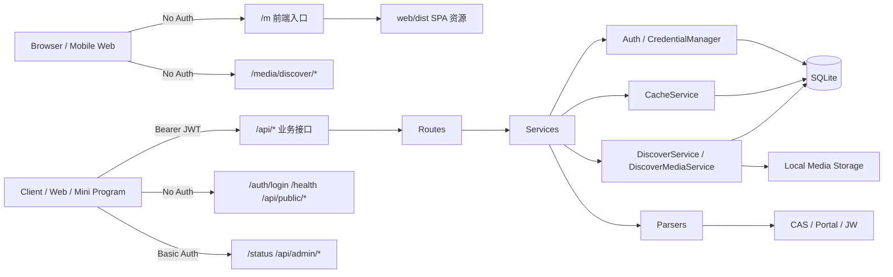

# HUAS Server 架构与维护文档

> 基线日期：2026-03-09
> 代码基线：当前工作区
> 目标读者：前端接入方、后端维护者、后续功能扩展开发者

## 1. 系统目标

- 对外提供统一的学生服务 API：登录、课表、成绩、一卡通、用户资料、公告、管理面板
- 对外提供发现美食能力：发帖、列表、推荐、评分、媒体访问
- 将学校认证链路全部收敛到服务端，客户端只管理本服务 JWT
- 在尽量减少重新登录的前提下，自动恢复学校侧短效凭证
- 通过本地缓存降低上游压力，并给前端提供显式的缓存元信息

非目标：

- 不改造学校认证体系
- 不向客户端暴露 Portal/JW/CAS 短期凭证
- 不做多租户 IAM

## 2. 技术栈与运行环境

| 层 | 当前实现 |
|---|---|
| Runtime | Bun |
| Language | TypeScript（ESM） |
| HTTP Framework | Hono |
| DB | SQLite（WAL） |
| ORM | Drizzle ORM |
| Cookie | tough-cookie |
| HTML 解析 | cheerio |
| 日志 | winston + winston-daily-rotate-file |

时间模型：

- 运行时在 `src/config.ts` 中强制 `process.env.TZ = 'Asia/Shanghai'`
- `beijingDate()`、`beijingIsoString()` 是所有文档、响应、日志时间格式的共同来源
- 对前端来说，所有 `_meta.*_at` 和管理端时间字段都应按 `+08:00` 解释

## 3. 路由与边界



实际路由注册见 `src/routes/index.ts`：

- 前端入口：`/m`、`/m/`、`/m/*`
- 公共路由：`/auth`、`/health`
- API 下的免 Bearer 路由：`/api/public/*`、`/api/admin/*`
- Bearer 业务路由：`/api/schedule`、`/api/v1/schedule`、`/api/grades`、`/api/ecard`、`/api/user`、`/api/discover/*`、`/api/treehole/*`
- 静态媒体路由：`/media/discover/*`
- 其余 `/api/*` 全部走 `authMiddleware`

维护时的关键点：

- `/m` 不是 API，而是前端 SPA 入口，静态产物来自 `web/dist`
- `/m/*` 中带扩展名的路径按静态资源处理，其余路径回退到前端 `index.html`
- 新增公开接口时，要显式决定是否放在 `/api/public/*` 或 `/auth/*`
- 新增管理接口时，放在 `/api/admin/*` 可以直接复用 Basic Auth
- 新增业务接口时，默认会被 Bearer 鉴权保护
- `discover` 图片访问不是 API 子路由，而是单独挂在 `/media/discover/*`

## 4. 分层职责

| 目录 | 职责 |
|---|---|
| `src/routes/{auth,system,content,academic,portal,discover,treehole,admin}/*` | 路由定义、参数读取、返回 `success/error`，按业务域和访问边界分类 |
| `src/middleware/*` | Bearer 鉴权、Basic Auth、日志、全局错误处理 |
| `src/services/{academic,portal,discover,treehole,content,admin,infra}/*` | 业务编排、缓存、上游调用、媒体处理与管理面板聚合 |
| `src/auth/*` | CAS 登录、票据交换、凭证刷新、静默重认证、JWT 签发 |
| `src/parsers/{academic,portal}/*` | 将学校 HTML/JSON 解析成稳定的数据结构，按上游来源分类 |
| `src/db/*` | SQLite 初始化、兼容迁移、Schema |
| `src/utils/*` | 时间、日志、错误码、响应包装、加密等基础能力 |

当前后端目录按职责归类为：

```text
src/
  routes/
    auth/       登录与认证入口
    system/     健康检查等系统路由
    content/    公告等公共内容路由
    academic/   教务相关路由
    portal/     门户相关路由
    discover/   Discover 业务路由
    treehole/   Treehole 业务路由
    admin/      后台管理路由
  services/
    academic/   教务业务编排
    portal/     门户业务编排
    content/    公共内容服务
    discover/   Discover 业务与媒体
    treehole/   Treehole 业务
    admin/      管理面板聚合
    infra/      缓存、上游调用、回退逻辑
  parsers/
    academic/   教务 HTML 解析
    portal/     门户 JSON 解析
```

默认工作流是：

1. `route` 提取参数
2. `service` 查缓存或回源
3. `upstream()` 负责凭证获取与恢复链路
4. `parser` 做结构化解析
5. `CacheService` 写入缓存
6. `success()` 统一出包

`discover` 模块是这条默认工作流之外的一条独立支线：

1. `src/routes/discover/discover.routes.ts` 读取表单 / JSON / query
2. `DiscoverService` 做分类、标签、评分与推荐逻辑
3. `DiscoverMediaService` 做图片压缩、存储和读取控制
4. 数据直接写 `discover_posts` / `discover_post_ratings`
5. 不经过学校上游，也不依赖 `CacheService`

## 5. 认证模型

### 5.1 凭证分层

| 凭证 | 生命周期 | 存储位置 | 作用 |
|---|---:|---|---|
| Self JWT | 90 天 | 客户端 | 访问本服务 API |
| CAS TGC | 约 24 小时 | `credentials.cookie_jar` | 刷新 Portal/JW 子凭证 |
| Portal JWT | 10 分钟 | `credentials.value` | 调 Portal API |
| JW Session | 10 分钟 | `credentials.cookie_jar` | 调 JW API |
| AES 加密密码 | 长期 | `users.encrypted_password` | 静默重认证 |

### 5.2 登录主流程

`POST /auth/login` 的真实链路：

1. 解析 JSON，请求体非法直接 `4002`
2. 若没有 `sessionId`，先向 CAS 获取 `execution`
3. 调 CAS 登录
4. 若 CAS 要求验证码：
   - 拉验证码图片
   - 重新获取 `execution`
   - 写入内存 `captchaSessions`
   - 返回 `needCaptcha=true`
5. 登录成功后激活 JW 会话
6. Upsert `users`
7. 落库 `cas_tgc`、`portal_jwt`、`jw_session`
8. 若 Portal Token 可用且本地资料缺失，尝试拉取一次用户资料回填姓名/班级
9. 签发本服务 JWT

### 5.3 验证码会话

这是维护时最容易忽略的一个隐式约束：

- `captchaSessions` 是进程内 `Map`
- 最大 1000 条
- TTL 10 分钟
- 服务重启后全部丢失
- `sessionId` 读取一次即删除

结论：

- 这是内存态，不在数据库中
- 多实例部署下，验证码二次提交必须命中同一实例，否则会失败
- 如果未来要支持多实例，需要把验证码会话迁移到 Redis 或数据库

### 5.4 Bearer JWT 鉴权

`authMiddleware` 的两个维护要点：

1. JWT 校验失败统一返回 `4001`
2. 如果 JWT 里的 `userId` 因数据库重建而失效，会按 `studentId` 做一次恢复查询

第二点很重要：这意味着数据库恢复/迁移后，旧 JWT 可能仍能靠 `studentId` 找回用户，而不是立即全部失效。

## 6. 凭证恢复链路

### 6.1 恢复优先级

`CredentialManager.getOrRefreshCredential()` 的决策链：

1. 凭证有效：直接返回
2. 子凭证过期：尝试用有效 TGC 刷新
3. TGC 也不可用：触发静默重认证

### 6.2 静默重认证

- 从 `users.encrypted_password` 解密出原始密码
- 重跑 CAS 登录流程
- 重建全部短效凭证
- 失败保护：
  - 连续失败上限 3 次
  - 冷却时间 1 分钟

### 6.3 运行时 `SESSION_EXPIRED`

`HttpClient.request()` 发现以下信号时会抛 `SESSION_EXPIRED`：

- 401 / 403
- 302 跳转到 `cas/login`
- 页面内容出现统一认证失效特征

`upstream()` 收到后会：

1. 使当前失效凭证失效
2. 重新构建上下文
3. 自动重试一次请求

仍失败则向客户端返回 `3003`。

### 6.4 瞬时异常重试

业务请求还叠加了“瞬时异常重试”：

- 默认最大尝试次数 2 次，含首次
- 主要针对超时、网络抖动
- `SESSION_EXPIRED` 不走这个逻辑，而是走凭证恢复链

## 7. 当前缓存架构

### 7.1 存储模型

缓存表是 `cache`：

| 字段 | 说明 |
|---|---|
| `key` | 唯一键 |
| `data` | JSON 字符串 |
| `source` | `jw` / `portal` 等来源标记 |
| `created_at` | 首次写入时间 |
| `updated_at` | 最近写入或触达时间 |
| `expires_at` | 过期时间，可为空 |

统一封装在 `src/services/infra/cache-service.ts`。

### 7.2 `refresh` 语义

所有业务 service 都遵循相同的缓存协议：

- `refresh=false`：先查缓存，命中返回
- `refresh=true`：跳过读缓存，强制回源，并覆盖写缓存
- 回源失败且有旧缓存：返回旧缓存，并设置
  - `_meta.stale = true`
  - `_meta.refresh_failed = true`
  - `_meta.last_error = 3003 | 3004 | 5000`

### 7.3 当前真实 TTL

当前不是设计稿里的“课表 24 小时”。

`src/config.ts` 中实际配置是：

| 配置项 | 当前值 |
|---|---:|
| `cacheTtl.schedule` | `0` |
| `cacheTtl.grades` | `0` |
| `cacheTtl.ecard` | `0` |
| `cacheTtl.user` | `0` |

对应接口效果：

| 接口 | 当前行为 |
|---|---|
| `GET /api/schedule` | 写缓存，不自动过期 |
| `GET /api/v1/schedule` | 写缓存，不自动过期 |
| `GET /api/grades` | 写缓存，不自动过期 |
| `GET /api/ecard` | 写缓存，不自动过期 |
| `GET /api/user` | 写缓存，不自动过期 |

也就是说：

- `TTL=0` 在这里表示“永久缓存直到手动刷新覆盖”
- 不表示“不缓存”
- 因为 `expires_at = null`，定时 `cleanupExpired()` 对这些缓存不会做任何删除

### 7.4 前缀限额

| 前缀 | 默认上限 | 来源 |
|---|---:|---|
| `grades:{studentId}:*` | 20 | `GRADES_CACHE_LIMIT` |
| `schedule:{studentId}:*` | 120 | `SCHEDULE_CACHE_LIMIT` |
| `portal-schedule:{studentId}:*` | 120 | `PORTAL_SCHEDULE_CACHE_LIMIT` |

淘汰 SQL 是：

- `ORDER BY updated_at DESC, id DESC`
- 保留前 `N` 条
- 删除偏移外的旧记录

### 7.5 “严格 LRU”与当前实现的差别

这点必须写明，否则后续维护很容易误判：

- 成绩缓存命中时会 `touch`，因此更接近严格 LRU
- JW / Portal 课表普通命中不会 `touch`
- 回源失败回退旧缓存时会 `touch`

所以当前状态是：

- `grades`：近似 LRU
- `schedule` / `v1 schedule`：更接近“最后成功写入/回退时间优先”

如果未来真的要把课表变成严格 LRU，需要在普通命中路径也传 `touch: true`。

### 7.6 成绩缓存键防膨胀

成绩接口已经实现以下保护：

- `term <= 32`
- `kcxz <= 32`
- `kcmc <= 64`
- 使用 `sha256(term\0kcxz\0kcmc).slice(0, 32)` 生成摘要 key
- 命中时 `touch`
- 每用户上限淘汰

这套保护直接覆盖了“随机参数轰炸导致缓存持久膨胀”的问题。

## 8. 业务接口真实返回形态

这部分写给前端和维护者，避免继续按旧文档理解。

### 8.1 课表接口

`/api/schedule` 与 `/api/v1/schedule` 当前都返回：

```json
{
  "week": "第3周",
  "courses": []
}
```

而不是：

- 数组
- 按日期分组对象

特殊情况“课表暂未公布”会被 `error.middleware` 转成：

```json
{
  "success": true,
  "data": {
    "week": "暂无",
    "courses": [],
    "message": "课表暂未公布"
  }
}
```

这是当前协议的一部分，前端必须按成功态处理。

### 8.2 Portal 课表与 JW 课表的字段差异

两者共用 `ICourse`，但 `weekStr` 的语义不同：

- JW：通常是原始周次文本，如 `1-16周`
- Portal：当前实现直接填具体日期，如 `2026-03-08`

如果未来前端要把两个接口结果合并展示，最好不要依赖 `weekStr` 的统一含义。

### 8.3 用户资料回填

用户资料并不只来自 `/api/user`：

- 登录成功后，如果拿到了 Portal Token 且本地资料缺失，会主动拉一次用户资料
- `/api/user` 成功时也会把 `name/className` 回写到 `users`

所以 `users.name` / `users.class_name` 是一个“逐步回填”的最终一致状态，而不是登录时就一定完整。

## 9. 数据落盘与本地文件

### 9.1 SQLite 表

`src/db/schema.ts` 当前有五张核心表：

#### `users`

- `student_id` 唯一
- 保存姓名、班级、AES 加密密码
- 记录 `created_at` 与 `last_login_at`

#### `credentials`

- 以 `(user_id, system)` 唯一
- `system` 目前只有 `cas_tgc`、`portal_jwt`、`jw_session`
- 同一用户同一系统始终只保留一条最新记录

#### `cache`

- `key` 唯一
- JSON 序列化数据
- 带来源与时间戳

#### `discover_posts`

- `user_id` 关联 `users.id`
- `category` 存帖子分类：`1食堂 / 2食堂 / 3食堂 / 5食堂 / 校外 / 其他`
- `images_json` 直接内嵌压缩后图片数组
- `tags_json` 直接内嵌标签数组
- `cover_url` / `image_count` 是列表页快速展示字段
- `rating_count` / `rating_sum` / `rating_avg` 是聚合评分字段
- `deleted_at` 为空表示可见，不为空表示已删除

#### `discover_post_ratings`

- `(post_id, user_id)` 唯一
- 一人一帖只保留一条评分
- `score` 当前只允许 `1-5` 整数
- 推荐流直接基于这张表和帖子标签/分类做召回

### 9.2 启动时数据库初始化

`initDatabase()` 会做：

- `PRAGMA journal_mode = WAL`
- `PRAGMA foreign_keys = ON`
- `PRAGMA busy_timeout = 5000`
- 创建五张表
- 为旧库补齐缺失列
- 回填关键时间戳
- 清理重复 `credentials`
- 清理重复 `discover_post_ratings`
- 补索引与唯一索引

结论：当前数据库迁移是“启动时兼容修复”，不是独立 migration 文件流。

### 9.3 文件态数据

维护时必须知道除了 SQLite 以外还有这些本地文件：

| 路径 | 用途 |
|---|---|
| `data/announcements.json` | 公告数据源 |
| `data/discover/` | 发现美食图片目录，默认跟随 `DB_PATH` 同级 |
| `logs/huas-YYYY-MM-DD.log` | 业务日志 |
| `logs/error-YYYY-MM-DD.log` | 错误日志 |
| `logs/pm2-out.log` | 管理仪表盘读取的 stdout 聚合日志 |
| `logs/pm2-error.log` | 管理仪表盘读取的 stderr 聚合日志 |

### 9.4 公告存储模型

公告模块是文件存储，不是数据库：

- 首次启动若文件不存在，会自动写入默认公告
- 公共接口返回精简字段
- 管理接口返回完整字段
- 写入通过进程内 `writeQueue` 串行化

维护风险：

- 这是单进程内串行，不是多实例分布式锁
- 如果未来改成多实例或多 Pod，公告应迁移到数据库或外部存储

## 10. 管理面板与可观测性

### 10.1 `/status`

- 返回静态 HTML 页面
- 受 Basic Auth 保护
- 用于浏览器查看状态页

### 10.2 `/api/admin/dashboard`

当前聚合的内容包括：

- 服务健康状态与当前时间
- 用户总量、今日活跃、7 日活跃、新增
- 缓存条数、凭证条数、进程内存、运行时长
- Discover 帖子总数、Discover 评分总数
- 用户列表分页与筛选
- 班级分布、年级分布
- 最近 Discover 帖子列表
- 最新 50 条 PM2 终端日志
- 公告列表

非直观点：

- 年级不是简单取学号前四位，而是扫描学号中第一个合法年份
- 未分配班级在筛选值中使用 `__UNASSIGNED__`
- 如果 `logs/pm2-*.log` 不存在，日志列表会为空，不会报错
- 管理页中的 Discover 删除操作复用 `/api/admin/discover/posts/:id`
- 管理页中的 Discover 图片预览直接使用 dashboard 返回的 `coverUrl/images`
- 管理页刷新时会同时刷新“最近操作日志”，所以公告操作和 Discover 操作会在同一个页面里同步可见

### 10.3 日志分类

控制台和文件日志大体分为：

- `AUTH`：主动登录
- `CAS↻`：静默刷新 / 静默重认证
- `OPS`：后台/业务操作日志，例如发帖、评分、删帖、公告管理
- `WARN`：缓存回退、解析异常、会话告警
- `ERR`：错误
- HTTP 访问尾标：
  - `▪ cache`：缓存命中
  - `▪ jw` / `▪ portal`：回源

## 11. 配置项与硬编码项

### 11.1 环境变量

| 变量 | 默认值 | 说明 |
|---|---|---|
| `PORT` | `3000` | 监听端口 |
| `NODE_ENV` | `production` | 运行环境 |
| `JWT_SECRET` | 默认弱值 | JWT 与 AES 加密密钥，生产必须改 |
| `DB_PATH` | `./data/huas.db` | SQLite 文件路径 |
| `LOG_LEVEL` | `info` | 日志级别 |
| `GRADES_CACHE_LIMIT` | `20` | 每用户成绩缓存上限 |
| `SCHEDULE_CACHE_LIMIT` | `120` | 每用户 JW 课表缓存上限 |
| `PORTAL_SCHEDULE_CACHE_LIMIT` | `120` | 每用户 Portal 课表缓存上限 |
| `BUSINESS_RETRY_MAX_ATTEMPTS` | `2` | 业务请求最大尝试次数 |
| `BUSINESS_RETRY_BASE_DELAY_MS` | `200` | 基础退避 |
| `BUSINESS_RETRY_MAX_DELAY_MS` | `800` | 最大退避 |
| `BUSINESS_RETRY_JITTER_MS` | `100` | 抖动 |
| `DISCOVER_STORAGE_ROOT` | `data/discover` | 发现美食图片根目录 |
| `DISCOVER_MEDIA_BASE_PATH` | `/media/discover` | 图片公开访问前缀 |
| `DISCOVER_MAX_IMAGES` | `9` | 单帖最大图片数 |
| `DISCOVER_MAX_TAGS` | `6` | 单帖最大标签数 |
| `DISCOVER_MAX_TITLE_LENGTH` | `80` | 标题最大长度 |
| `DISCOVER_MAX_TAG_LENGTH` | `12` | 单个标签最大长度 |
| `DISCOVER_IMAGE_MAX_BYTES` | `8388608` | 单图最大字节数，默认 8 MB |
| `DISCOVER_IMAGE_MAX_DIMENSION` | `1280` | 压缩后最长边 |
| `DISCOVER_IMAGE_QUALITY` | `78` | WebP 压缩质量 |

### 11.2 当前硬编码项

以下内容现在不是环境变量：

| 项目 | 位置 | 当前值 / 行为 |
|---|---|---|
| 时区 | `src/config.ts` | 固定 `Asia/Shanghai` |
| Self JWT TTL | `src/config.ts` | 90 天 |
| TGC TTL | `src/config.ts` | 24 小时 |
| Portal/JW 子凭证 TTL | `src/config.ts` | 10 分钟 |
| 缓存 TTL | `src/config.ts` | 全部为 `0` |
| 验证码会话上限 | `src/routes/auth/auth.routes.ts` | 1000 |
| 验证码会话 TTL | `src/config.ts` | 10 分钟 |
| 定时清理周期 | `src/config.ts` | 1 小时 |
| 管理员账号密码 | `src/middleware/admin-basic-auth.middleware.ts` | 写死 |
| Dashboard 页大小 | `src/services/admin/dashboard-service.ts` | 20 |
| Dashboard 日志条数 | `src/services/admin/dashboard-service.ts` | 50 |
| Discover 分类枚举 | `src/utils/discover.ts` | `1食堂/2食堂/3食堂/5食堂/校外/其他` |
| Discover 常用标签 | `src/utils/discover.ts` | `好吃/便宜/分量足/辣/清淡/排队久/值得再吃` |

维护结论：

- 想改缓存 TTL，目前必须改代码并重新部署
- 想改管理员账号密码，目前必须改代码

## 12. 扩展开发 Playbook

### 12.1 新增一个业务接口

推荐顺序：

1. 在 `src/parsers/academic/*` 或 `src/parsers/portal/*` 新增解析器，把学校原始响应收敛成稳定结构
2. 在 `src/services/` 新增 service
3. 如果需要学校凭证，走 `upstream(userId, 'jw' | 'portal', handler)`
4. 明确缓存策略：
   - key 设计
   - TTL
   - 是否需要前缀限额
   - 命中时是否 `touch`
5. 如果希望支持“回源失败回退旧缓存”，复用 `fallbackOnRefreshFailure()`
6. 在 `src/routes/<domain>/*` 注册新路由
7. 补测试
8. 更新 `API.md` 与本文件

最重要的几个判断点：

- 这个接口属于 `jw` 还是 `portal`
- 是否需要 `refresh`
- 是否允许返回 stale 数据
- 是否会被恶意参数放大缓存 key

### 12.2 新增缓存型接口的建议模板

- `cacheKey` 尽量稳定、短、小
- 用户输入参与 key 时，先做长度限制或摘要化
- 回源成功后统一 `CacheService.set`
- 若是多查询组合接口，考虑按用户前缀配限额
- 若文档上要写“LRU”，必须确认读命中是否真的会 `touch`

### 12.3 新增管理接口

如果接口仅供后台使用：

- 放到 `src/routes/admin/admin.routes.ts`
- 默认复用 Basic Auth
- 优先复用 `success()` / `error()`
- 如果需要仪表盘展示，可在 `AdminDashboardService` 做聚合

### 12.4 新增公共接口

如果接口允许未登录访问：

- 放到 `src/routes/content/public.routes.ts`
- 或新增 `/auth/*` 下的公开路由
- 确保不会误落入 Bearer 鉴权路径

### 12.5 变更登录链路时的检查清单

只要碰以下任何一个文件，都要回归登录与恢复测试：

- `src/auth/auth-engine.ts`
- `src/auth/credential-manager.ts`
- `src/auth/ticket-exchanger.ts`
- `src/core/http-client.ts`
- `src/routes/auth/auth.routes.ts`
- `src/parsers/{academic,portal}/*` 中的会话失效判断

至少要验证：

- 正常登录
- 验证码二次提交
- Portal/JW 子凭证刷新
- TGC 失效触发静默重认证
- 运行时 `SESSION_EXPIRED` 自动恢复

### 12.6 新增或修改 Discover 能力的检查清单

只要碰以下任何一个文件，都要回归 `discover` 相关测试与手工链路：

- `src/routes/discover/discover.routes.ts`
- `src/routes/admin/admin.routes.ts` 中 `/api/admin/discover/*`
- `src/services/discover/discover-service.ts`
- `src/services/discover/media-service.ts`
- `src/utils/discover.ts`
- `src/index.ts` 中 `/media/discover/*`

至少要验证：

- 发帖表单能成功创建帖子
- 图片被压缩成单份 WebP
- 最新、高分、推荐三种列表正常
- 一人一帖一分仍然成立
- 作者不能给自己评分
- 删除帖子后，详情/列表消失，旧图片 URL 也返回 `404`

## 13. Discover 模块架构

### 13.1 目标与边界

`discover` 是一个有意与教务、Portal、缓存体系解耦的内容模块。

它只复用两样基础设施：

- 现有 `users` 表，作为作者和评分用户来源
- 现有 Bearer JWT / 管理员 Basic Auth 体系，作为权限边界

它明确不依赖这些能力：

- 学校上游接口
- `CredentialManager`
- `upstream()` 凭证恢复链路
- `CacheService`
- 公告文件存储

这意味着：

- 学校上游波动不会影响 `discover`
- `discover` 故障不会拖垮登录、课表、成绩等主业务
- 部署上它仍是同一个服务进程，但业务逻辑边界是独立的

### 13.2 路由与权限模型

当前 discover 暴露三组路由：

- `GET /api/discover/meta`
- `GET/POST/DELETE /api/discover/posts*`
- `DELETE /api/admin/discover/posts/:id`
- `GET /media/discover/*`

权限规则：

- `/api/discover/*` 全部要求 Bearer JWT
- `/api/admin/discover/*` 复用管理员 Basic Auth
- `/media/discover/*` 无需鉴权，但会校验图片所属帖子仍未删除

这里有一个关键实现细节：

- 图片访问不看 JWT
- 图片访问也不只是“文件存在就返回”
- 它会先根据 URL 中的 `storageKey` 查 `discover_posts`
- 只有找到未删除帖子时才真正读文件

所以“删帖后图片仍可访问”不属于允许行为，而是明确被拦截的。

### 13.3 Treehole 边界

当前 treehole 暴露两组路由：

- `GET/POST/PUT/DELETE /api/treehole/*`
- `DELETE /api/admin/treehole/*`

权限规则：

- `/api/treehole/*` 全部要求 Bearer JWT
- `/api/admin/treehole/*` 复用管理员 Basic Auth
- treehole 没有公开媒体路由，所有内容都通过 API JSON 返回

当前 treehole 的数据模型由三张表组成：

1. `treehole_posts`
2. `treehole_post_likes`
3. `treehole_comments`

关键约束：

- 作者来自 `treehole_posts.user_id -> users.id`
- 点赞来自 `treehole_post_likes.user_id -> users.id`
- 评论作者来自 `treehole_comments.user_id -> users.id`
- `treehole_post_likes(post_id, user_id)` 唯一，保证同一用户不会重复点赞
- `treehole_posts.deleted_at IS NULL` 代表帖子仍可见
- `treehole_comments.deleted_at IS NULL` 代表评论仍可见

### 13.4 Discover 数据模型与落盘策略

当前 discover 只新增两张业务表：

1. `discover_posts`
2. `discover_post_ratings`

这是有意做的耦合式设计，目标是降低复杂度：

- 图片信息直接放在 `discover_posts.images_json`
- 标签直接放在 `discover_posts.tags_json`
- 平均分和评分人数直接聚合到 `discover_posts`
- 不再单拆图片表、标签表、统计表

当前字段上的关键约束：

- 帖子作者来自 `discover_posts.user_id -> users.id`
- 评分用户来自 `discover_post_ratings.user_id -> users.id`
- 评分目标来自 `discover_post_ratings.post_id -> discover_posts.id`
- `discover_post_ratings(post_id, user_id)` 唯一，保证一人一帖一分
- `discover_posts.deleted_at IS NULL` 代表帖子可见

设计权衡：

- 优点是实现快、查询直接、迁移成本低
- 代价是图片和标签不可单独局部更新，复杂统计也不如拆表灵活

对于当前规模，这个权衡是合理的。

### 13.4 发帖、评分、删除的核心链路

发帖链路：

1. 路由层接收 `multipart/form-data`
2. 校验分类、标签、图片数量
3. `DiscoverMediaService.compressAndStoreImages()` 同步压缩并落盘
4. `DiscoverService.createPost()` 写入 `discover_posts`
5. 返回帖子详情结构

评分链路：

1. 校验 `score` 是否为 `1-5` 整数
2. 校验帖子存在且未删除
3. 校验不是作者给自己评分
4. 对 `discover_post_ratings` 做 upsert
5. 在事务里重新聚合 `rating_count / rating_sum / rating_avg`
6. 返回更新后的帖子详情

删除链路：

1. 作者删除只允许命中自己的帖子
2. 管理员删除可删除任意未删除帖子
3. 先把 `deleted_at` 写入数据库
4. 再尝试删除对应 `storageKey` 目录
5. 即便删文件失败，也不回滚删帖结果，只记日志

这条删除策略的含义是：

- API 语义以“帖子已下线”为第一优先级
- 文件清理属于伴随动作，不阻塞主删除流程

### 13.5 列表与推荐逻辑

discover 当前有三种列表模式：

- `latest`
- `score`
- `recommended`

`latest`：

- 只看未删除帖子
- 按 `published_at DESC, id DESC`

`score`：

- 只看未删除帖子
- 按 `rating_avg DESC, published_at DESC, id DESC`

`recommended`：

- 从当前用户评分历史中提取偏好
- 权重规则是 `max(score - 2, 0)`
- 基于历史高分帖的分类和标签召回候选帖子
- 过滤本人发布和已评分帖子
- 最终按 `匹配分 -> 平均分 -> 发布时间` 排序

这里要特别注意两点：

- 它不是热门推荐，没有浏览量、点赞量、收藏量因子
- 如果用户没有有效偏好，或召回结果为空，会退化到“最新的可推荐帖子”，但仍排除本人发布和已评分帖子

### 13.6 媒体处理与生产行为

当前媒体实现刻意保持轻量：

- 不做审核
- 不保留原图
- 不做多尺寸版本
- 不做对象存储直传

当前真实行为：

1. 上传图片进入服务端
2. 使用 `sharp` 同步压缩
3. 自动旋转图片方向
4. 输出单份 `WebP`
5. 最长边压到 `1280`
6. 质量默认 `78`
7. 文件落在 `config.discover.storageRoot`

公开访问规则：

- URL 前缀默认是 `/media/discover`
- Nginx 只做代理，请求仍由应用判断能否访问
- 应用确认帖子未删除后才会读盘返回
- 响应使用 `Cache-Control: no-store`，避免删帖后旧图长期留在浏览器或 CDN 缓存里

生产上的边界条件：

- 单帖最多 9 张图
- 单图默认最多 8 MB
- Nginx `client_max_body_size` 已提高到 `100m`

这意味着“应用允许但网关拦截”的上传边界已经对齐。

### 13.7 后续切 OSS 的替换点

当前结构是为了后续切 OSS 留了口子，但没有提前引入复杂度。

未来若改对象存储，主要替换点只有 `DiscoverMediaService`：

- `compressAndStoreImages()` 从“写本地文件”改成“上传 OSS”
- `removeStorage()` 从“删目录”改成“删对象”
- `getPublicFile()` 从“本地读盘”改成“签名 URL / 代理回源 / 对象存在性检查”

数据库层不需要推翻：

- `discover_posts.images_json` 仍可继续存 URL
- `cover_url` 仍然有效
- `storage_key` 仍可作为对象目录前缀

所以当前方案是“先本地跑通，再平滑切 OSS”，不是一次性把 OSS 复杂度带进来。

## 14. 测试与回归点

当前关键测试文件：

| 文件 | 覆盖重点 |
|---|---|
| `tests/business-flows.test.ts` | 登录、验证码、缓存、回退、限额、防膨胀 |
| `tests/public-announcements.test.ts` | 公告公开路由、管理面板年级解析 |
| `tests/upstream-retry.test.ts` | 上游重试 |
| `tests/discover.test.ts` | 发帖、压缩、评分、推荐、管理员删除、媒体 404 回归 |
| `tests/e2e.live.test.ts` | 真实账号在线链路 |

修改这些能力时必须优先回归：

- 缓存键 / TTL / `refresh` 语义
- `SESSION_EXPIRED` 检测
- `SCHEDULE_NOT_AVAILABLE` 的特殊成功态
- JWT 鉴权与 `studentId` 恢复逻辑
- 公告读写

## 15. 已知限制与后续建议

### 15.1 当前限制

1. 所有业务缓存 TTL 目前都是 `0`，不自动过期，前端如果不主动 `refresh=true` 可能长期看到旧数据。
2. 课表缓存不是真正严格 LRU。
3. 管理员账号密码写死在代码里。
4. 公告是本地文件存储，只适合单实例。
5. 验证码会话是内存态，只适合同实例二次提交。
6. `refresh=true` 只保证绕过本地缓存，不保证学校侧一定更“新”。
7. Discover 图片当前是本地磁盘存储，适合单机或共享盘，不适合多实例直接横向扩容。
8. Discover 推荐当前只基于评分、标签和分类，没有显式行为日志与特征画像。

### 15.2 优先级较高的演进建议

1. 把缓存 TTL 改为环境变量或配置文件可控。
2. 把公告与验证码会话迁移到共享存储，解除单实例限制。
3. 把管理员凭证迁移到环境变量或独立配置。
4. 为课表命中补 `touch`，让限额真正变成严格 LRU。
5. 给管理面板增加显式版本号、配置快照与最近失败统计。
6. 当 discover 需要多实例部署时，把媒体存储从本地磁盘迁到 OSS / S3 / COS。
