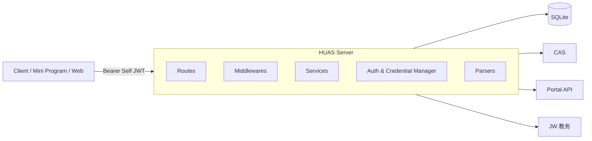
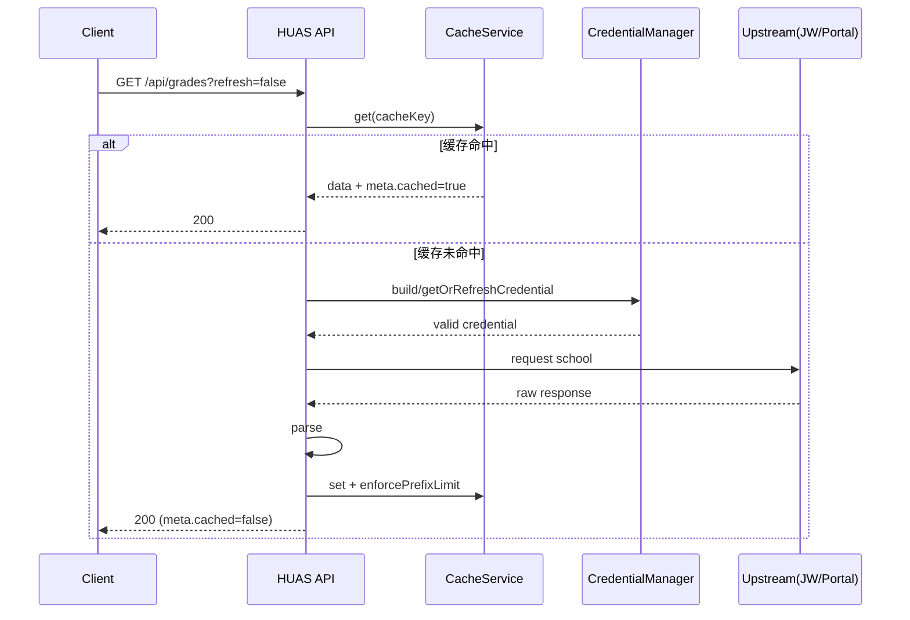

# HUAS Server 详细架构文档

> 版本：2026-03-07
> 代码基线：`master`（Bun + TypeScript + Hono + SQLite/Drizzle）

## 1. 目标与边界

### 1.1 系统目标
- 对外提供稳定、统一的学生服务 API：登录、课表、成绩、一卡通、用户信息。
- 将学校复杂认证流程（CAS/TGC/Portal/JW）完全收敛在服务端，客户端只管理自有 JWT。
- 在保证 `refresh=true` 强制回源语义的前提下，使用缓存提升性能并降低上游压力。
- 支持凭证自动恢复（静默刷新、静默重认证），减少“重新登录”频率。

### 1.2 非目标
- 不做学校侧身份体系改造。
- 不作为通用 IAM（仅服务本项目 API）。
- 不在客户端暴露学校侧短期凭证。

---

## 2. 技术栈与运行环境

- 运行时：Bun
- 语言：TypeScript（ESM）
- Web 框架：Hono
- 数据库：SQLite（WAL 模式）
- ORM：Drizzle ORM
- Cookie 管理：tough-cookie
- HTML/JSON 解析：cheerio + 自定义 parser
- 日志：winston + winston-daily-rotate-file

---

## 3. 逻辑拓扑

### 3.1 分层职责
- `src/routes/*`：参数提取与路由编排。
- `src/middleware/*`：鉴权、日志、错误转换。
- `src/services/*`：业务编排（缓存、上游访问、回源策略）。
- `src/auth/*`：登录、票据交换、凭证生命周期。
- `src/parsers/*`：学校响应格式转换为稳定数据结构。
- `src/db/*`：表结构、连接、初始化、约束。

---

## 4. 认证体系（双层认证）

### 4.1 凭证层级

| 凭证 | 生命周期 | 作用 | 存储位置 |
|---|---:|---|---|
| Self JWT | 90 天 | 客户端访问本服务 API | 客户端 |
| CAS TGC | ~20 小时 | 派生 Portal/JW 凭证 | `credentials.cookie_jar` |
| Portal JWT | ~10 分钟 | 请求 Portal 接口 | `credentials.value` |
| JW Session | ~10 分钟 | 请求 JW 接口 | `credentials.cookie_jar` |
| 加密密码 | 长期 | 静默重认证 | `users.encrypted_password` |

### 4.2 外层 JWT
- 签发位置：`src/auth/jwt.ts`
- 算法：HS256
- Payload：`userId`、`studentId`、`iat`、`exp`
- 鉴权中间件：`src/middleware/auth.middleware.ts`
- 失败返回：`4001` + HTTP 401

### 4.3 登录主流程（`POST /auth/login`）
1. 解析请求体，校验 `username/password`。
2. 首次登录：新建 `HttpClient`，获取 execution。
3. 调用 CAS 登录：
   - 成功：拿到 ticket，提取 Portal Token。
   - 失败且需验证码：生成验证码 challenge（`needCaptcha/sessionId/captchaImage`）。
4. 成功后激活 JW 会话（最多 3 次重试）。
5. 拉取用户信息（不阻断登录成功）。
6. upsert 用户，保存加密密码。
7. 存储凭证：`cas_tgc`、`portal_jwt`（若有）、`jw_session`。
8. 签发 Self JWT 并返回。

### 4.4 验证码二次提交
- 服务端缓存 `captchaSessions`（最多 1000 条，TTL 10 分钟）。
- 客户端带 `sessionId + captcha` 重试时复用上次 Cookie/Jar 与 execution。

---

## 5. 凭证刷新与恢复链路

### 5.1 `getOrRefreshCredential` 决策链
1. 凭证仍有效：直接返回。
2. 子凭证过期：尝试用有效 TGC 刷新。
3. TGC 不可用或刷新失败：触发静默重认证。

### 5.2 静默重认证（`silentReAuth`）
- 使用数据库中 AES 解密后的密码重跑 CAS 登录流程。
- 成功后重建并写回全部短效凭证。
- 失败保护：
  - 连续失败上限：3 次
  - 冷却时间：10 分钟

### 5.3 运行时会话失效恢复
- `HttpClient.request()` 检测到 401/403 或 302 跳 `cas/login` => 抛 `SESSION_EXPIRED`。
- `upstream()` 捕获后：
  1. 失效凭证删除
  2. 重建上下文（触发刷新链）
  3. 自动重试一次
- 仍失败则返回 `3003`（需重新登录）。

---

## 6. 缓存架构与防护

### 6.1 缓存存储模型
- 表：`cache`
- 唯一键：`key`
- 字段：`data/source/created_at/updated_at/expires_at`
- 访问封装：`src/services/cache-service.ts`

### 6.2 `refresh` 语义（统一）
- `refresh=false`：先查缓存，命中即返回。
- `refresh=true`：跳过读缓存，强制回源，并覆盖写缓存。

### 6.3 TTL 策略
- `schedule` / `v1 schedule`：24 小时
- `grades` / `ecard` / `user`：`0`（不过期，仅手动刷新更新）

### 6.4 LRU 限额（按用户前缀）
- 成绩：`grades:{studentId}:*`，默认最多 20 条（`GRADES_CACHE_LIMIT`）
- JW 课表：`schedule:{studentId}:*`，默认最多 120 条（`SCHEDULE_CACHE_LIMIT`）
- Portal 课表：`portal-schedule:{studentId}:*`，默认最多 120 条（`PORTAL_SCHEDULE_CACHE_LIMIT`）
- 淘汰策略：按 `updated_at DESC` 保留新记录，删除偏移外旧记录。

### 6.5 成绩接口漏洞修复（缓存键放大）
已实现以下防护：
- 参数长度限制：`term<=32`、`kcxz<=32`、`kcmc<=64`
- 键摘要化：`sha256(term\0kcxz\0kcmc).slice(0,32)`，避免超长 key
- 命中时 `touch` 更新时间（保证 LRU 按真实访问行为）
- 每用户上限淘汰，阻断随机参数轰炸导致持久增长

---

## 7. 业务接口与数据源映射

| 接口 | 上游来源 | 缓存键 | TTL | 限额 | 强制刷新 |
|---|---|---|---|---|---|
| `GET /api/schedule` | JW | `schedule:{sid}:{date}` | 24h | 120/用户 | 支持 |
| `GET /api/v1/schedule` | Portal | `portal-schedule:{sid}:{start}:{end}` | 24h | 120/用户 | 支持 |
| `GET /api/grades` | JW | `grades:{sid}:{hash}` | 永不过期 | 20/用户 | 支持 |
| `GET /api/ecard` | Portal | `ecard:{sid}` | 永不过期 | 无专属限额 | 支持 |
| `GET /api/user` | Portal | `user:{sid}` | 永不过期 | 无专属限额 | 支持 |

### 7.1 参数校验策略
- `/api/schedule`：`date` 必须为 `YYYY-MM-DD` 且为真实日期。
- `/api/v1/schedule`：
  - `startDate/endDate` 必须为 `YYYY-MM-DD`
  - `endDate >= startDate`
  - 区间上限 62 天
- `/api/grades`：查询参数长度限制（见 6.5）。

---

## 8. 数据库设计

### 8.1 表结构

### `users`
- `id` PK
- `student_id` UNIQUE
- `name` / `class_name`
- `encrypted_password`
- `created_at` / `last_login_at`

### `credentials`
- `id` PK
- `user_id` FK -> `users.id`
- `system` (`cas_tgc` / `portal_jwt` / `jw_session`)
- `value` / `cookie_jar`
- `expires_at`
- `created_at` / `updated_at`
- 唯一约束：`(user_id, system)`

### `cache`
- `id` PK
- `key` UNIQUE
- `data` / `source`
- `created_at` / `updated_at` / `expires_at`

### 8.2 启动时初始化
`initDatabase()` 会执行：
- `PRAGMA journal_mode=WAL`
- `PRAGMA foreign_keys=ON`
- 三表创建（若不存在）
- 历史重复凭证清理
- 索引和唯一索引补齐

### 8.3 定时清理
每小时执行：
- 删除过期 `credentials`
- 删除过期 `cache`（仅 `expires_at` 非空项）

---

## 9. 错误模型

| 错误码 | HTTP | 含义 |
|---|---:|---|
| 3001 | 400 | CAS 登录/激活失败 |
| 3002 | 400 | 验证码错误或需要验证码 |
| 3003 | 401 | 凭证过期（恢复失败） |
| 3004 | 504 | 学校上游超时 |
| 4001 | 401 | Self JWT 无效或过期 |
| 4002 | 400 | 参数错误 |
| 5000 | 500 | 服务端内部异常 |

错误处理入口：`src/middleware/error.middleware.ts`

---

## 10. 可观测性

### 10.1 日志分类
- `AUTH`：用户主动登录
- `CAS↻`：凭证静默刷新/静默重认证
- `WARN`：恢复链路警告或解析告警
- `ERR`：异常
- HTTP 行尾标记：
  - `▪ cache`：缓存命中
  - `▪ jw` / `▪ portal`：上游回源

### 10.2 日志落盘
- `logs/huas-YYYY-MM-DD.log`（业务日志）
- `logs/error-YYYY-MM-DD.log`（错误日志）

---

## 11. 请求生命周期（端到端）

---

## 12. 安全设计

- 客户端不持有学校短效凭证。
- 登录密码仅服务端保存，且以 AES-GCM 加密。
- JWT 使用独立密钥（`JWT_SECRET`），生产必须更换。
- 鉴权强制 Bearer，统一中间件拦截。
- 参数白名单与长度限制，避免缓存键、SQL、上游请求被滥用。
- 缓存上限与哈希键设计防止持久化膨胀。

---

## 13. 测试体系

### 13.1 业务流测试（mock）
文件：`tests/business-flows.test.ts`
覆盖：
- 登录成功、验证码挑战重试
- JW/Portal 凭证过期刷新
- TGC 失效触发静默重认证
- 缓存命中与强制刷新
- 数据库唯一键、外键、upsert
- 漏洞回归：成绩缓存键放大防护
- 课表参数校验 + LRU 限额

### 13.2 在线 E2E 测试（真实账号）
文件：`tests/e2e.live.test.ts`
覆盖：
- 登录落库
- JWT 失效返回 401
- JW 过期自动刷新
- 运行时 `SESSION_EXPIRED` 恢复重试（含 retry）
- 可选：TGC+子凭证同时过期触发静默重认证

---

## 14. 微信小程序接入架构（无框架）

### 14.1 客户端建议模块
- `api/request.ts`：统一 `wx.request` 封装（超时、重试、错误映射）
- `api/auth.ts`：登录、验证码二次提交、token 持久化
- `api/services.ts`：按业务调用 `/api/*`
- `store/session.ts`：当前 token 和用户态
- `pages/*`：仅做展示和交互，不直接写网络逻辑

### 14.2 鉴权/刷新实践
- 登录成功保存 Self JWT（不保存学号密码）。
- 全部业务请求携带 `Authorization: Bearer <token>`。
- 收到 `4001`：清理 token，跳登录页。
- 平时 `refresh=false`，仅用户主动刷新时 `refresh=true`。

### 14.3 小程序侧可观测性
- 请求失败按错误码聚合上报。
- 重点监控：`3003`（恢复失败需重登）、`3004`（上游超时）。

---

## 15. 配置项

| 变量 | 默认值 | 说明 |
|---|---|---|
| `PORT` | `3000` | 监听端口 |
| `NODE_ENV` | `production` | 运行环境 |
| `JWT_SECRET` | - | JWT 与 AES 加密密钥 |
| `DB_PATH` | `./data/huas.db` | SQLite 文件路径 |
| `LOG_LEVEL` | `info` | 日志级别 |
| `GRADES_CACHE_LIMIT` | `20` | 每用户成绩缓存上限 |
| `SCHEDULE_CACHE_LIMIT` | `120` | 每用户 JW 课表缓存上限 |
| `PORTAL_SCHEDULE_CACHE_LIMIT` | `120` | 每用户 Portal 课表缓存上限 |

---

## 16. 当前架构结论

该实现已形成完整闭环：
- 认证：双层凭证 + 自动恢复
- 性能：缓存 + 强制刷新并存
- 稳定性：运行时会话过期自愈
- 安全性：缓存防膨胀与参数防滥用
- 可测试性：mock 业务流 + live E2E

可作为生产基线继续演进，优先建议后续补充：
1. 接口级限流（IP + userId 双维度）
2. 关键链路指标（成功率/耗时）上报
3. 灰度开关（按接口启用更严格防护）
