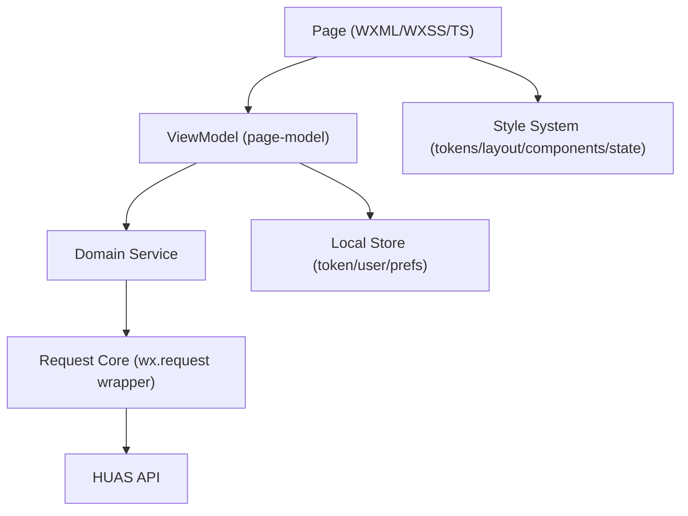

# HUAS 微信小程序（原生无框架）前端架构文档

> 版本：2026-03-07  
> 适用范围：`miniprogram/` 前端工程（微信小程序原生，不使用第三方 UI/状态框架）

## 1. 文档输入与范围

本架构文档基于以下输入编写：
- 服务端架构契约：`doc/ARCHITECTURE.md`
- 服务端 API 契约：`doc/API.md`
- 样式基线（仅样式文件）：`doc/html:css/**/*.wxss`

边界说明：
- 视觉与样式分层只参考 `wxss`，不依赖页面脚本实现细节。
- 业务流程、鉴权、错误语义遵循服务端文档中的既定契约。

## 2. 设计目标

1. 原生可维护：不引入框架，依旧保持模块边界清晰、职责稳定。  
2. 样式可扩展：把页面中重复出现的视觉模式沉淀为可复用设计系统。  
3. 接口可演进：前端按 API 契约分层，避免页面直接耦合后端细节。  
4. 性能可控：减少冗余 `setData`、避免样式漂移、降低页面改动风险。  

## 3. 总体架构



分层原则：
- Page 层只做展示与交互绑定，不直接写 API 拼接和错误码判断。
- Domain Service 负责业务语义（课表、成绩、一卡通、用户信息）。
- Request Core 负责认证头、重试、超时、错误映射。
- Style System 负责统一视觉 token、布局原语、状态样式。

## 4. 推荐目录结构

```text
miniprogram/
  app.ts
  app.json
  app.wxss
  core/
    request/
      index.ts            # wx.request 统一封装
      auth.ts             # token 注入与 401/4001 处理
      error.ts            # error_code -> 前端语义错误
    storage/
      token.ts            # JWT 读写
      user.ts             # 用户基础信息缓存
  services/
    auth.service.ts
    schedule.service.ts
    grades.service.ts
    ecard.service.ts
    user.service.ts
  models/
    api.ts                # API DTO 类型
    view.ts               # 页面 ViewModel 类型
  pages/
    login/
    index/
    more/
    about/
  components/
    hero-title/
    list-card/
    modal-sheet/
    skeleton-block/
    pill-tag/
  styles/
    tokens.wxss           # 颜色/字号/圆角/阴影/z-index
    base.wxss             # reset + page 基础规范
    layout.wxss           # hero/list/section/footer 等布局原语
    components.wxss       # modal/pill/tag/skeleton/tabbar 等
```

## 5. API 契约分层（与服务端一致）

认证与会话：
- `POST /auth/login` 获取 JWT，JWT 有效期 90 天。
- 除 `/auth/login`、`/health` 外，全部 `/api/*` 需要 `Authorization: Bearer <token>`。
- 收到 `4001`：清理本地 token 并回到登录页。
- `3003` 代表服务端凭证恢复失败，需要用户重新登录。

统一查询语义：
- 所有业务查询默认 `refresh=false`，优先使用服务端缓存语义。
- 用户主动下拉刷新或手动刷新按钮时才传 `refresh=true`。

错误码映射（前端标准）：
- `3001`：登录/认证链路失败（展示明确提示）。
- `3002`：验证码错误或需要验证码（登录页进入验证码流程）。
- `3003`：凭证过期且恢复失败（强制重登）。
- `3004`：上游超时（可重试提示）。
- `4001`：JWT 失效（清会话并跳登录）。
- `4002`：参数错误（前端校验缺失，按开发错误处理）。
- `5000`：服务端异常（兜底提示 + 上报）。

## 6. 页面与业务模块划分

按业务域拆分服务，不按页面堆逻辑：
- `auth.service`：登录、验证码提交、token 落盘、自动登录入口。
- `schedule.service`：`/api/schedule` 与 `/api/v1/schedule` 聚合策略。
- `grades.service`：成绩查询与筛选参数组装。
- `ecard.service`：一卡通余额查询。
- `user.service`：用户资料查询与会话信息同步。

页面职责建议：
- `pages/login`：账号输入、验证码弹层、登录态恢复提示。
- `pages/index`：课表主视图、周导航、课程详情弹窗、公告入口。
- `pages/more`：成绩/一卡通/自定义课程配置与弹窗编辑。
- `pages/about`：信息展示与外链入口。

## 7. 样式系统架构（只基于现有 wxss）

### 7.1 视觉 Token（抽取为全局变量）

从现有样式提炼出的核心 token：
- 背景：`#F9F9FB`（页面底色）、`#FFFFFF`（卡片底色）
- 主色：`#D2FF72`（品牌高亮、主按钮、选中态）
- 文字：`#111111`（主文案）、`#888888/#AAAAAA`（次级/弱文案）
- 危险：`#FF3B30`（失败状态、危险动作）
- 圆角：`8/12/16/24/100rpx`（从细粒度到胶囊）
- 阴影：轻阴影（卡片）+ 中阴影（弹窗）

建议在 `styles/tokens.wxss` 统一定义并在页面导入，避免魔法值散落。

### 7.2 布局原语（可复用）

现有样式已形成稳定布局模式，可沉淀为原语：
- `hero-section + title-black/title-yellow`：页面头部统一视觉。
- `content-area + section + section-title`：内容分组框架。
- `list-card + list-row + list-content`：列表卡片基座。
- `modal-mask + modal-content/modal-popup`：统一弹窗容器。
- `list-row-tag/nav-pill/pill-btn`：胶囊按钮与标签体系。

### 7.3 状态样式（语义化）

状态类应保持“语义名优先”：
- 交互：`.active`、`.show`、`.row-hover`
- 数据状态：`.pass`、`.fail`
- 风险状态：`.danger-text`
- 公告类型：`.type-info`、`.type-warning`、`.type-error`

禁止以视觉命名状态（如 `.red-text`），避免后续换肤牵一发而动全身。

### 7.4 动效规范

保留并统一两类必要动画：
- 骨架屏呼吸：`@keyframes skeletonPulse`
- 弹窗入场：`@keyframes pop`

规则：
- 动效仅服务“加载反馈”和“层级切换”，不做装饰性堆叠。
- 统一时长区间 `0.2s - 0.35s`，统一缓动曲线，减少认知抖动。

### 7.5 设备适配

必须保留并统一：
- `env(safe-area-inset-bottom)`：底部安全区适配。
- `rpx` 为主的尺寸体系。
- `min-height: 100vh` 的页面容器约束。

## 8. 原生小程序代码风格规范

TypeScript：
- 开启严格模式，禁止 `any` 扩散。
- API 响应类型统一声明：`ApiSuccess<T>`、`ApiFailure`。
- 页面只持有 ViewModel，不直接保留后端原始 DTO。

命名：
- 文件：`kebab-case`；类型：`PascalCase`；函数变量：`camelCase`。
- 样式类：`kebab-case`，状态类使用语义后缀（如 `.is-loading` 可选）。

页面代码结构（固定顺序）：
1. `types/constants`
2. `data`
3. `lifecycles`
4. `event handlers`
5. `effects/loaders`
6. `formatters`

## 9. 可维护性与扩展策略

### 9.1 新增业务模块标准流程

1. 在 `models/api.ts` 增加接口 DTO。  
2. 在 `services/*.service.ts` 实现请求与数据标准化。  
3. 在页面层仅消费标准化后的 ViewModel。  
4. 在 `styles/` 复用已有布局原语，禁止重复拷贝大段样式。  
5. 新状态优先扩展语义类，不直接改动基础组件类。  

### 9.2 样式扩展规则

- 新页面优先复用 `hero/list-card/modal/pill` 原语。
- 新颜色先走 token 增量，不允许在页面直接写硬编码色值。
- 组件级样式需要明确“默认态/激活态/禁用态/危险态”四类。

### 9.3 性能与稳定性基线

- 合并 `setData`，避免循环内频繁更新。
- 长列表使用骨架屏和分段渲染，降低首次抖动。
- 弹窗、公告、详情统一单一开关状态，避免并发弹层。

## 10. 质量门禁（建议）

发布前必须通过：
1. API 契约校验：错误码处理覆盖 `3001/3002/3003/3004/4001/4002/5000`。  
2. 样式一致性校验：主色、危险色、圆角、阴影仅来自 token。  
3. 交互一致性校验：按钮按压态、弹窗开合、骨架屏动画统一。  
4. 适配校验：iOS/Android 真机下安全区与底部 TabBar 无遮挡。  

## 11. 与当前样式基线的对齐结论

当前 `doc/html:css/**/*.wxss` 已具备可沉淀为设计系统的基础：
- 已形成稳定的 Hero/List/Modal/Pill/Skeleton 五大视觉模式。
- 已形成明确的主色、高危色、层级阴影和圆角语言。
- 已具备安全区与状态类实践。

下一步重点不是重写样式，而是把重复模式上收为 `tokens + layout + components` 三层，配合 API 分层落地，即可在原生无框架下实现长期可维护和可扩展。
