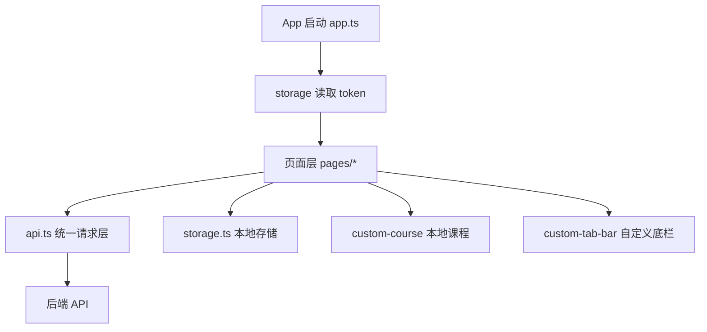

# HUAS 小程序维护文档（架构与变更总览）

> 更新时间：2026-03-07  
> 适用范围：`./miniprogram`

## 1. 目标与使用方式

本文档用于维护与扩展当前微信小程序，覆盖：
- 实际代码架构（不是建议稿）
- 页面与模块职责
- API 接入方式与错误处理
- 本地缓存与失效策略
- 关键变更记录（便于回溯）

建议每次改动后同步更新本文档的“变更记录”和“缓存策略”两节。

## 2. 当前架构（As-Is）



分层说明：
- `pages/*`：页面状态、交互、展示逻辑。
- `utils/api.ts`：请求封装、鉴权头、响应标准化、错误码映射。
- `utils/storage.ts`：登录态与缓存 key 的统一读写。
- `utils/custom-course/index.ts`：自定义课程的增删改查与周次格式化。
- `custom-tab-bar/*`：底部导航展示与切页逻辑。

## 3. 目录职责

```text
miniprogram/
  app.ts                         # 全局启动，初始化 token 与登录态
  app.json                       # 页面注册、TabBar、超时、运行配置
  app.wxss                       # 全局基础样式
  utils/
    config.ts                    # API_BASE_URL 统一入口
    api.ts                       # 请求层与 API 方法集合
    storage.ts                   # 本地存储封装
    util.ts                      # 通用工具（轻触觉等）
    custom-course/index.ts       # 自定义课程模块
  pages/
    login/                       # 登录页 + 验证码 + 公告弹窗入口
    index/                       # 课表页（双数据源、时间线、课程详情）
    more/                        # 用户信息、成绩、一卡通、自定义课程、清缓存
    about/                       # 关于页
  custom-tab-bar/                # 自定义 TabBar
```

## 4. API 架构与请求约定

### 4.1 Base URL 统一入口

- 统一配置文件：`miniprogram/utils/config.ts`
- 当前值：`http://10.32.245.18:3000/`
- `api.ts` 内会做标准化（去尾斜杠）后拼接路径。

### 4.2 请求封装行为（`utils/api.ts`）

- 统一走 `request<T>()`。
- `auth=true` 时自动注入 `Authorization: Bearer <token>`。
- `wx.request` 失败统一映射为 `{ code: -1, msg: 网络异常... }`。
- 兼容服务端信封格式：
  - 成功：`{ success: true, data, _meta }`
  - 失败：`{ success: false, error_code, error_message }`
- 鉴权失败码 `4001/3003`：清 token + 清用户信息 + `reLaunch` 登录页。

### 4.3 已实现接口清单

| 方法 | 路径 | 鉴权 | 前端方法 |
|---|---|---|---|
| POST | `/auth/login` | 否 | `api.login` |
| GET | `/api/schedule` | 是 | `api.getSchedule` |
| GET | `/api/v1/schedule` | 是 | `api.getPortalSchedule` |
| GET | `/api/grades` | 是 | `api.getGrades` |
| GET | `/api/ecard` | 是 | `api.getECard` |
| GET | `/api/user` | 是 | `api.getUserInfo` |
| GET | `/health` | 否 | `api.health` |
| GET | `/api/public/announcements` | 否 | `api.getPublicAnnouncements` |

公告接口特殊处理：
- 若返回 404，前端转为 `code=404, msg='公告接口暂未上线', data=[]`，不抛异常。

## 5. 页面职责与数据流

### 5.1 登录页 `pages/login`

- 负责账号密码登录、验证码流程、自动登录。
- `rememberPassword=true` 时保存本地凭据。
- 登录成功后写入：
  - `token`
  - `last_login_username`
  - 可选 `credentials`
- 支持公告入口（未登录也可查看，读取公告并记录已读 ID）。

### 5.2 课表页 `pages/index`

- 支持两数据源：`默认(/api/schedule)` 与 `备用(/api/v1/schedule)`。
- 每周 5 大节（1-2 到 9-10）动态高度布局，避免底部被遮挡。
- 支持课程冲突并排渲染、当前时间线、课程详情弹窗。
- 融合自定义课程（`custom-course`）并按周过滤显示。

### 5.3 服务页 `pages/more`

- 用户信息读取（本地优先）。
- 成绩查询/分学期分组展示。
- 一卡通余额查询。
- 自定义课程增删改（支持多时段、周次批量选择）。
- 清缓存（保留登录态、账号信息、自定义课程）。

### 5.4 关于页 `pages/about`

- 静态功能说明、文案展示、复制联系方式。

## 6. 本地存储与缓存策略

### 6.1 存储 Key（核心）

| Key | 含义 |
|---|---|
| `token` | 登录令牌 |
| `user_info` | 用户信息缓存 |
| `credentials` | 记住密码时保存的账号密码 |
| `remember_password` | 是否记住密码 |
| `last_login_username` | 上次登录账号 |
| `custom_course_changed` | 自定义课程变更标记 |
| `schedule_cache_cleared` | 手动清缓存后课表强制刷新标记 |
| `cache_schedule_*` | 课表缓存（按数据源+日期） |
| `cache_grades` | 成绩缓存（带时间戳） |
| `cache_grades_by_term` | 分学期成绩缓存（带时间戳） |
| `cache_ecard` | 一卡通缓存（带时间戳） |
| `announcement_read_ids` | 公告已读 ID 列表 |
| `custom_courses` | 自定义课程列表 |

### 6.2 TTL 与失效规则

1. 课表缓存：
- TTL：24 小时
- Key：`cache_schedule_${dataSourceIndex}_${date}`
- 读写结构：`{ timestamp, data, updatedAtText }`
- 每次拉取会做 GC：清理超过 24 小时的 `cache_schedule_*`
- 若自定义课程发生变化：一次性清空全部 `cache_schedule_*`（已修复脏读问题）

2. 成绩缓存：
- TTL：6 小时
- 读写结构：`{ timestamp, data, updatedAtText }`
- 旧格式（非 timed cache）会自动清理

3. 一卡通缓存：
- TTL：5 分钟
- 读写结构：`{ timestamp, data, updatedAtText }`
- 旧格式（非 timed cache）会自动清理

4. 清缓存按钮行为：
- 删除前缀 `cache_` 与 `announcement_` 的 key
- 保留：`token`、`credentials`、`custom_courses`
- 同时写入 `schedule_cache_cleared=true`，触发首页强制刷新

5. 最近更新时间展示：
- 首页课表、更多页成绩、一卡通均显示“最近更新（北京时间）”灰色小字。
- 优先使用服务端 `_meta.updated_at`；若缺失则回退到本地拉取时间。

## 7. 样式与布局维护要点

1. 底部安全区与 TabBar 遮挡规避：
- `index`：`.schedule-scroll` 使用 `padding-bottom: calc(140rpx + env(safe-area-inset-bottom))`
- `more/about`：页面容器统一 `padding-bottom: calc(140rpx + env(safe-area-inset-bottom))`
- `custom-tab-bar`：固定定位 + `padding-bottom: env(safe-area-inset-bottom)`

2. 课表 9-10 节可见性：
- `index.ts` 中 `calculateLayout()` 动态计算 `sectionHeight/periodHeight`
- 预留顶部区与底部区，避免最后一节被覆盖且不可滚动

3. 视觉语言：
- 主色：`#D2FF72`
- 主文本：`#111111`
- 页面底色：`#F9F9FB`
- 卡片圆角与弱阴影保持一致，不在页面随意新增风格分支

4. 更新时间提示样式：
- 使用弱对比灰色小字（20rpx 左右），位置贴近数据区域标题，不抢主内容层级。

## 8. 错误提示策略

1. API 层：
- 统一返回 `ApiResponse<T>`，页面按 `code` 与 `msg` 展示。

2. 页面层：
- 课表、用户信息、成绩、一卡通失败时使用 `res.msg` 或兜底 toast。
- 公告读取失败给出 toast，不阻断主流程。
- 未登录态也允许直接查看公告，不额外提示登录。

3. 登录态失效：
- `4001/3003` 自动回登录页，避免页面停留在失效态。

## 9. 扩展规范（后续开发必须遵守）

1. 新增接口：
- 只在 `utils/api.ts` 新增方法，不在页面直接 `wx.request`。
- 输出统一 `ApiResponse<T>`，并在页面消费 `msg`。

2. 新增缓存：
- 必须声明 TTL。
- 统一使用 `{ timestamp, data, updatedAtText }` 结构。
- 明确失效触发条件（手动刷新、业务事件、账号切换）。

3. 新增页面：
- 容器默认处理 `safe-area-inset-bottom`。
- 使用已有 Hero/Card/Tag 风格，不复制多套视觉体系。

4. 涉及账号态的改动：
- 必须考虑 `last_login_username` 切换逻辑与本地数据隔离。

## 10. 变更记录（2026-03-07）

1. API 与配置
- Base URL 收敛到 `utils/config.ts` 单点来源。
- 请求层统一使用 `ApiResponse` 和服务端信封格式映射。

2. 页面反馈
- 补齐课表、用户信息、成绩、一卡通失败提示，优先展示后端 `msg`。

3. 布局可用性
- 修复课表 9-10 节与底部内容被遮挡问题，完善滚动区与安全区预留。

4. 缓存一致性（本次重点）
- 修复自定义课程变更后课表缓存失效不完整：改为清理全部 `cache_schedule_*`。
- 为成绩缓存新增 6 小时 TTL。
- 为一卡通缓存新增 5 分钟 TTL。
- 兼容并清理旧版无时间戳缓存结构。

5. 公告可见性与数据更新时间
- 公告接口为公开访问（`/api/public/announcements` 无需 Bearer Token）。
- 登录页支持未登录查看公告，并恢复未读红点判断。
- 课表、成绩、一卡通新增“最近更新（北京时间）”提示，便于识别数据新鲜度。

## 11. 已知风险（待后续排期）

1. `credentials` 为本地明文存储，存在设备侧泄露风险。
2. `clearCacheKeepLogin` 按前缀删除，后续新增 key 命名需避免误删。
3. `user_info` 目前无 TTL，依赖手动刷新更新。
